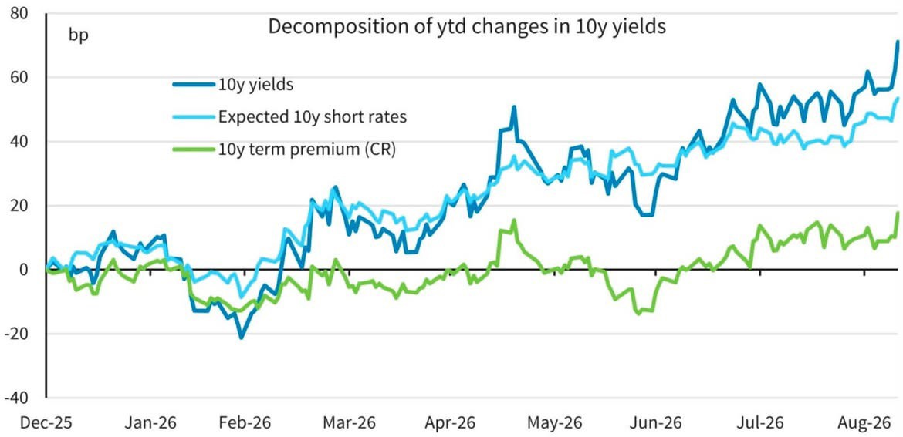

# 美債 Vol 的定價轉變 — 內容整理

> - 原文：【市況觀察 — 美債 Vol 的定價轉變】（資料時點：2026/10/1）
> - 整理日期：2026/10/3；2026/10/5 依 Bloomberg 資料更新結論並新增第 15 節
> - 「結論」與第 11～15 節為整理者補充（結論、名詞速查、閱讀筆記、合理性評論、圖表與模型解讀、數據驗證），非原文觀點；第 0～10 節依原文順序整理

---

## 結論（整理者，2026/10/5 依 Bloomberg 資料更新）

**一句話：9/23 起，美債從「預期主導」轉進「TP 主導」；MOVE 跳升約六成是追上實際波動、四成是溢價擴大，屬於初期失序，還沒到 3 月或 2025 年 4 月那種極端。**

### 已經可以確定的

1. **Regime change 有明確的起點：9/23**（15.4 節）。9/1–9/22 是預期主導的熊市變平：2Y +41.2 bp、30Y 只 +5.7 bp，MOVE 幾乎不動、信用平靜。9/23–10/1 反過來變成 TP 主導的熊市變陡：3M −1.4、2Y +3.8，10Y +27.9、30Y +31.3；2s10s +24.2 bp，MOVE +29.6，Kim-Wright TP 三天 +8.6 bp，HY OAS +52 bp。
2. **MOVE 跳升：追上 RV 為主，溢價擴大為輔**（15.5 節）。9/22 → 10/2 MOVE +28.7，其中 10Y 21 日 RV +17.8（約 62%），IV − RV 從 +4.2 擴大到 +15.2（2017–2025 年第 86 百分位）。3/26 開戰衝擊與 2025/4/8 關稅衝擊時都在 +28～+29（第 95 百分位）。
3. **實質利率貢獻約九成，通膨預期很小**（15.3 節）。今年以來 10Y +110 bp，其中 TIPS +101、BEI +12；開戰低點以來 +135 bp 中 TIPS 佔 +123，與原文「實質利率貢獻約 120 bp」一致。實質利率之中，DKW 顯示近四成是實質 TP（14.7 節）。
4. **TP 是第二大來源，7 月起持續上升、9 月加速**：DKW 名目 TP 今年到 8 月 +20 bp（約 35%）；Kim-Wright 8/31 88 → 9/22 93 → 9/25 102 bp（14.6、14.7 節）。
5. **5–8 月的低 IV 有實際波動配合**（15.5 節）：MOVE 平均 73、10Y RV 73，IV − RV ≈ 0，和 2017–2025 年平均相當；但 5 月底到 7 月初 IV 平均落後 RV 7 bp（最低 −18），呼應原文「RV 上升、IV 被壓住」的機制。
6. **信用 Buffer 從很緊的位置開始變薄**（15.6 節）：HY OAS 9/22 266 → 10/1 318 bp，但仍只在 2017–2025 年第 29 百分位，低於 3/30 的 335 與 2025/4 的 453。

### 還無法確定的

- **Payer Skew**：沒有 Swaption 資料，無法確認右尾避險需求是否同步升溫。
- **事後 VRP**：10/2 的 MOVE 是否偏貴，要等之後 21 個交易日的實際波動。9 月上旬的 MOVE 事後看來偏便宜：之後的實際波動比它高約 18 bp。
- **DKW**：只到 8/31，9 月的實質 TP 與預期實質短率拆解要等 Fed 月更。

### 實務上怎麼用

- **Vol**：IV − RV 約 +15（86 百分位），不便宜，也還不到極端。賣 Vol 要等失序緩解（TP 停止加速、HY 利差回落），並用價差限制損失；買右尾保護的成本已比 9 月上旬高。
- **曲線**：TP 主導期有利於 bear steepener（9/23 後 2s10s +24 bp），但今年以來曲線整體是變平的（2s10s 69 → 45 bp）；若數據再推升短端，會回到變平。
- **BEI**：今年以來只 +12 bp、升息後還小跌，仍是戰事升級（能源衝擊）的便宜保險。
- **信用**：HY 與 CDX HY 已先反應（+52、+43 bp），IG 只 +8 bp；壓力目前集中在高收益。
- **盯的訊號**：Kim-Wright TP 的速度、IV − RV 是否續升、HY OAS 能否回到 300 以下、2Y 是否重新領漲（回到預期主導）。

---

## 0. 一段話看懂全文

本輪美債拋售主要由**實質利率**推動（政策利率預期上修 ＋ AI 投資競逐長期資本），而非通膨預期脫錨或財政溢價上升。在這種「**預期主導**」的行情裡，選擇權買方不願多付保險費，Swaption Implied Vol 反而被壓在低檔（VRP 萎縮）。近期短率轉為震盪、**TP 反彈**、MOVE 同步勁揚至 110，作者認為美債（尤其 Vol）的定價可能正從「預期主導」轉向「**TP 主導**」，也就是 **Regime Change**。MOVE 上升主要反映長端 Buy Side 的避險與停損，短期內不必然觸發去槓桿與跨市場 Risk-Off，但會加速削減信用市場的 Buffer。

---

## 1. 市況背景

### 1.1 關鍵數據

| 項目 | 數據 / 描述 |
|---|---|
| 10Y 美債殖利率 | 10/1 一度觸及 **5.34%**，創 2002 年以來新高 |
| 美伊開戰以來累計 | 上漲**超過 130 bp** |
| 9 月單月 | 上行約 **60 bp** |
| 上行來源拆解 | 實質利率貢獻約 **120 bp**；其餘（推算約 10 餘 bp）來自 BEI 與 TP |
| 2026/5–9 | 10Y 自 **4.3%** 一路升至接近 **5.3%** |
| 同期 3m10y Swaption IV | 停滯在 **70–80 bp/y** 的歷史低檔區間 |
| MOVE | 10/1 升至 **110**，接近 2026/3 月底的高點 |
| 對照：2025/4 關稅戰 | MOVE 飆到 **140** |

### 1.2 時間軸

| 時間 | 事件 |
|---|---|
| 2025/4 | 關稅戰觸發股市 Sell-Off → 追繳保證金踩踏、Basis Trade 大量 Unwind → MOVE 飆到 140 |
| 2026/3 月底 | MOVE 前波高點 |
| 2026/5–9 | 10Y 4.3% → 接近 5.3%，但 3m10y Swaption IV 停在 70–80 bp/y |
| 2026/9 | Warsh 升息，之後通膨預期下降；10Y 單月上行約 60 bp |
| 近期（至 10/1） | 升息預期不再往右尾定價、短率轉震盪；但 TP 反彈、長率續升；MOVE 幾乎同時勁揚 |
| 2026/10/1 | 10Y 一度觸及 5.34%；MOVE 升至 110 |

文中未註明日期的事件：美伊開戰（至今 10Y 累計上漲超過 130 bp）、Warsh 上任 Fed 主席後大幅削減 Forward Guidance、Bessent 擴大公債回購（之後 TP 回落）。

> 「TP 在回購後回落」與「近期 TP 反彈」指的是不同時段（先降後升），兩者並不矛盾。

---

## 2. 本輪拋售的驅動：「不是什麼」vs.「是什麼」

### 2.1 不是：與市場熱烈討論的方向不同

| 市場流行的說法 | 作者的反駁依據 |
|---|---|
| 能源衝擊使通膨預期脫錨（BEI ↑） | 通膨預期在 **Warsh 9 月升息後下降** |
| 政府大量發債使 Fiscal Premium 上升（TP ↑） | TP 在 **Bessent 擴大回購後回落** |

作者評價：兩位都做到「當前能力範圍內最正確的決定」，而且也都有效果。

### 2.2 是：實質利率急遽上升，主因兩點

1. **未來政策利率預期提升**
2. **AI 投資對長期資本的競逐**

而且第 2 點又會進一步推升第 1 點。

---

## 3. 近期變化 → 兩個核心問題 → Regime Change 預告

### 3.1 近期變化

- 升息預期不再往右尾定價 → **短率轉為震盪**
- 但 **TP 反彈** → 長率延續上行
- **MOVE 幾乎同時勁揚**，10/1 升至 110，接近 2026/3 月底的高點

### 3.2 作者提出的兩個問題

- **Q1**：債市已經被激進做空一個多月，為何 MOVE 此時才上升？
- **Q2**：這是否代表對股市的壓力及去槓桿即將到來？

### 3.3 預告

若短期內**戰事與基本面的路徑沒有太大變化**，接下來美債（尤其 Vol）的定價或將迎來 **Regime Change**。

Q1 由第 4～7 節的框架回答，Q2 由第 8 節回答，兩題的答案彙整在第 9 節。

---

## 4. 異常現象：殖利率噴出，IV 卻停在低檔

| | 內容 |
|---|---|
| 傳統市場邏輯 | 利率越高 → 終端政策利率與財政可持續性的不確定性越大 → 波動度理應同步擴張 |
| 實際觀察（2026/5–9） | 10Y 自 4.3% 噴出至接近 5.3%，但基準 3m10y Swaption IV 停滯在 70–80 bp/y 歷史低檔 |
| 解謎關鍵 | 剖析 Yield Variance 的「底層驅動因素」 |

---

## 5. 分析框架

### 5.1 殖利率拆解

- 美債殖利率 = 實質利率（TIPS）＋ 通膨預期（BEI）＋ Term Premium（TP）
- 因此 Nominal Yield − TIPS = BEI ＋ TP

### 5.2 變異數拆解

依 Philadelphia Fed 的專業預測者調查（**SPF**）與 **Kim-Wright Term Structure Model**，10Y 美債的變異數可拆為：

```
Yield Variance = Var(Expectation Shocks)
               + Var(Term Premium Shocks)
               + 2 × Cov(Expectations, Term Premium)
```

### 5.3 核心命題

- 選擇權買方主要願意為 **Term Premium Shocks** 支付額外的風險補償
- 當利率變動主要由央行政策路徑的 **Expectation Shocks** 驅動時，**VRP 反而萎縮**

### 5.4 VRP 的定義

- VRP = 隱含波動度 − 未來實現波動度（**IV − RV**）
- 本質是選擇權買方向賣方支付的「保險費」
- 當利率變化的主導力量在 TP 與政策預期之間切換時，買方的支付意願與定價機制會顯著分化

### 5.5 造成分化的四個原因（第 6 節逐一展開）

1. 避險工具的可替代性
2. Realized 與 Implied Vol 的動態壓縮
3. 風險分佈的邊界與尾端特質存在本質差異
4. 交易者結構與市場博弈心理

---

## 6. 四大機制逐一拆解

### 6.1 機制一：避險工具的替代性 —「線性風險好對沖，非線性尾端風險難對沖」

**(A) Policy Expectation Shocks：可由低成本線性工具直接覆蓋**

- 驅動：總經數據（NFP、CPI、PCE）＋ 央行的 Reaction Function，即 Data Dependent
- 性質：方向性、具清晰宏觀邏輯、流動性高
- 可用工具：SOFR Futures、Fed Funds Futures、SOFR OIS、Fed Funds OIS、T-Bills
  - 深度佳、交易成本低，能精準 Mapping DV01
- 結果：既然能用極低成本的工具管理利率風險，就沒必要為選擇權（Non-Linear Convexity Tools）支付昂貴 Premium，還得管理複雜的 Greeks → **壓低買方對 Short Expiry Option 的額外補償意願**

**(B) Term Premium Shocks：難以用線性工具消除的結構性風險**

- TP 反映的結構性失衡：
  - 財政赤字失控
  - 國債供給消化不良
  - 流動性枯竭
  - 地緣政治動盪
  - 外國官方買家退場、國內私人機構持有增加
- 通常伴隨市場微結構的破壞：
  - Market Maker 的資產負債表受限
  - Repo Haircut 加大
  - 跨資產避險失效（如股債負相關性失靈）
- 避險者：Liability Driven 的 Pension Funds、Lifers、Sovereign Funds
- 面對的風險：未知的供給吸收障礙與失序拋售 → **無錨定上限的極端右尾風險**
- 需要的工具：非線性凸性保護（如 **Deep OTM Payer Swaptions**）
- 結果：避險需求高度 **Price-Inelastic**，願意支付遠超常態的保險費

### 6.2 機制二：RV 劇烈釋放，擠壓 IV 與 RV 的利差空間

**(A) 預期主導期：RV 大幅飆升，推高賣方 Delta Hedging 成本**

- 每次重要經濟數據公布或央行會議，利率都會出現方向明確的大幅跳空與趨勢性行情 → RV 顯著拉高
- Warsh 上任主席後大幅削減 Forward Guidance → 進一步放大每次重要數據公布的市場反應
- 對選擇權賣方（Short Gamma）：劇烈波動下進行 Dynamic Delta Hedge，產生大量「追高殺低」的 Gamma 損耗 → 侵蝕收進來的 Time Value

**(B) IV 存在宏觀錨定上限，無法等比例擴張**

- 政策利率預期不會無限發散，受中性利率（r*）、Taylor Rule 與潛在經濟增速約束 →（理論上）利率不可能無止境上升而不引發衰退
- 因此選擇權市場對政策利率的 IV 往往在合理區間內被「錨定」
- 過去一段時間，大量系統性做空波動度的 Hedge Funds 積極壓低 IV → 即便殖利率持續走揚，波動度仍維持低位
- RV 因宏觀數據衝擊而放大、IV 又受理論上限壓制 → 兩者差距萎縮 → **Sell Vol 的 VRP 縮水**
- 這是近期 **Sell Vol Flow 逐漸退場**的另一個底層原因

### 6.3 機制三：不確定性的分佈特徵 — 有邊界的常態分佈 vs. 肥尾的黑天鵝

**(A) 預期衝擊：「條件均值回歸」的相對有界分佈**

- 市場修正政策路徑，本質是在預測央行何時達到 Terminal Rate
- 升息達到一定高度 → 市場自發定價貨幣緊縮對經濟的冷卻效果 → 抑制利率 Upside
- 雙向牽制 → 機率分佈偏向均值回歸、缺乏 Fat Tails → **Tail Risk Premium 較低**

**(B) 期限溢價衝擊：「自我強化」與「非對稱肥尾」**

- 財政供給過剩與 TP 上升之間**不存在天然的經濟煞車機制**
- 殖利率飆升 → 融資抵押品追繳保證金（如 2022 年英國 LDI 危機）→ 倒逼機構進一步拋售現貨
- 惡性循環：**拋售 → 波動度上升 → VaR 上限觸發 → 進一步拋售**
- 選擇權 Market Maker 面對缺乏基本面定錨的 Tail Shock，為了防範資產負債表爆倉，會在報價中加上較高的 Risk Premium 與 Liquidity Premium → **推升 TP 主導環境下的 VRP**

### 6.4 機制四：交易者結構與市場博弈心理

**(A) 預期主導：套利資本充沛，市場理性定價**

- 主要參與者：宏觀對沖基金、相對價值（RV）基金、量化交易者
- 對利差與定價偏差高度敏感 → IV 稍有偏高，套利資本便迅速進場 Sell Vol、賺取 Time Value → **把 VRP 壓回合理水位**

**(B) TP 主導：被動避險與監管剛性需求激增**

- 情境：市場擔憂主權債信譽受損、長債發行量增加
- 買方：需要滿足資本適足率、償付能力監管標準，或匹配 Asset Liability Risk 的機構
- 動機：以資本安全與監管合規為首要考量，而非短期交易獲利 → **更願意接受較高的 VRP** → 墊高整個選擇權市場的價格

---

## 7. Swaptions 策略意涵

| 環境 | 特徵 | 對 Short Vol 的意涵 |
|---|---|---|
| **預期主導期** | 宏觀數據受高度重視，市場積極重定價央行升降息路徑 | 單純 Short Gamma 容易遭 RV 上揚侵蝕，**風報比低** |
| **TP 主導期** | 政策路徑大致清晰，市場轉向定價「消化長端公債供給與財政赤字需要多少溢價」 | IV 往往因 Hedging Panic 而 Overvalued → 對尋求短期獲利的機構 Trader，是**系統性做空並變現 VRP 的較佳窗口** |

> ⚠️ 作者提醒：當前債市的右尾風險肯定也不低，尤其 **AI Financing 也加入長端資本競逐**。

---

## 8. 總結：MOVE 上升代表什麼？會不會引發去槓桿？

### 8.1 MOVE 上升的本質

- 是 Implied Vol 被**系統性抬升**的結果
- 反映持有 Long End Duration Exposure 的大型 Buy Side 機構開始**加大避險與停損力度**

### 8.2 不代表短期內會立即大幅去槓桿、跨市場轉向 Risk-Off

- Hedge Funds 持有美債的規模雖持續增加（補上 Fed 及海外央行減持的部分）
- 但在 **eSLR 放寬後**，Basis Trade 的操作規模已逐漸移轉至 **G-SIBs**
- 這些 Primary Dealers 對價格的敏感度與調倉頻率不如 Hedge Funds → **Repo Market 的脆弱性有所改善**

### 8.3 歷史對照：2025/4 關稅戰

- 股市 Sell-Off → 追繳保證金踩踏 → Basis Trade 大量 Unwind → MOVE 飆到 140
- 現在重演的可能性小了許多

### 8.4 仍值得注意

- MOVE 出現 **High Level Clustering** 時，仍很難不引起 Rates Trader、Bond Trader 及 Credit Trader 的注意
- MOVE 長時間維持高位（Outright Yields 持續上行）不一定馬上使股市估值修正，因為 AI Narratives 仍是能硬扛高殖利率的 Solid Story
- 但這**無疑正在加速削減信用市場的 Buffer 與風險承受力**

---

## 9. 回到開頭的兩個問題

**Q1：債市已被激進做空一個多月，為何 MOVE 現在才上升？**

依作者的框架，可以串成三步：

1. 5–9 月的上行以「預期主導」為主 → 線性工具即可避險、IV 被 r* / Taylor Rule 錨定、分佈有界、套利資本積極 Sell Vol → VRP 萎縮，IV 停在 70–80 bp/y
2. 同時 RV 放大、IV 被壓 → Short Vol 的獲利空間（VRP）縮水 → Sell Vol Flow 逐漸退場，壓低 IV 的力量變弱
3. 近期短率轉為震盪、TP 反彈 → 驅動力轉向 TP → 長端 Buy Side 加大避險與停損（Price-Inelastic 的凸性需求）→ IV 被系統性抬升 → MOVE 升至 110

**Q2：是否代表股市壓力與去槓桿即將到來？**

作者認為短期內不會立即觸發大幅去槓桿與跨市場 Risk-Off：

- eSLR 放寬後 Basis Trade 部位逐漸移往 G-SIBs，Repo 市場脆弱性改善
- 與 2025/4（MOVE 140、Basis Trade 踩踏）相比，重演的可能性小很多
- 股市有 AI Narrative 撐著，壓力會先體現在**信用市場 Buffer 的削減**；MOVE 高位群聚仍值得 Rates / Bond / Credit Trader 警惕

---

## 10. 一頁總覽

### 10.1 對照總表：預期主導 vs. TP 主導

| 面向 | 預期主導（Expectation Shocks） | TP 主導（Term Premium Shocks） |
|---|---|---|
| 驅動因素 | 總經數據 ＋ 央行 Reaction Function（Data Dependent） | 財政赤字、國債供給、流動性、地緣政治、持有者結構 |
| 避險工具 | 線性工具：SOFR / FF Futures、OIS、T-Bills | 非線性凸性：Deep OTM Payer Swaptions |
| 買方價格彈性 | 高（有便宜的替代品） | 極低（Price-Inelastic） |
| RV vs. IV | RV 飆升、IV 被錨定 → IV − RV 被壓縮 | IV 因 Hedging Panic 被抬升，容易 Overvalued |
| 分佈特徵 | 條件均值回歸、相對有界、缺乏肥尾 | 自我強化、非對稱肥尾、無天然煞車 |
| 主要參與者 | 宏觀 HF、RV 基金、量化交易者 | Pension Funds、Lifers、Sovereign Funds |
| VRP 的定價力量 | 套利資本 Sell Vol，把 VRP 壓回合理水位 | 做市商加上 Risk / Liquidity Premium，剛性買盤接受高 VRP |
| VRP | 萎縮 | 擴張 |
| Short Vol 策略 | 風報比低 | 較佳窗口（但須留意右尾） |
| 本文對應 | 2026/5–9：10Y 4.3% → 接近 5.3%，IV 停在 70–80 bp/y | 近期跡象：短率震盪、TP 反彈、MOVE 升至 110（作者認為接下來可能轉入此 Regime） |

### 10.2 整體邏輯鏈

```
美伊開戰
  └─ 實質利率急升（130+ bp 中約 120 bp）
       ├─ 政策利率預期上修
       └─ AI 投資競逐長期資本（並回頭推升政策利率預期）
                    ↓
2026/5–9「預期主導」：10Y 4.3% → 接近 5.3%
  ├─ 線性工具即可避險 → 不需付高 Premium 買選擇權
  ├─ RV ↑、IV 被 r* / Taylor Rule 錨定 → IV − RV 被壓縮
  ├─ 分佈均值回歸、缺乏肥尾 → Tail Risk Premium 低
  └─ 套利資本積極 Sell Vol
                    ↓
VRP 萎縮、IV 停在 70–80 bp/y；Short Vol 獲利空間縮水 → Sell Vol Flow 逐漸退場
                    ↓
近期：升息預期不再往右尾定價、短率震盪；但 TP 反彈、長率續升
                    ↓
長端 Buy Side 加大避險與停損 → IV 被系統性抬升 → MOVE 升至 110（10/1）
                    ↓
可能的 Regime Change：預期主導 → TP 主導（前提：戰事與基本面路徑沒有大變化）
  ├─ 策略：TP 主導下 IV 易 Overvalued → Short Vol 的較佳窗口
  │         （但右尾風險不低：AI Financing 也在競逐長端資本）
  └─ 風險：去槓桿機率低於 2025/4（eSLR 放寬、Basis Trade 移往 G-SIBs）
            但信用市場的 Buffer 與風險承受力正被削減
```

---

## 11. 名詞速查（整理者補充）

### 波動度與選擇權

| 名詞 | 說明 |
|---|---|
| MOVE Index | ICE BofA 編製的美債選擇權隱含波動度指數（1 個月期，2Y/5Y/10Y/30Y 加權），以 bp 表示，常被稱為「債市 VIX」 |
| 3m10y Swaption | 3 個月後到期、標的為 10 年期利率交換（IRS）的選擇權；Vol 以 Normal Vol（bp/y）報價 |
| bp/y 換算 | 年化 Normal Vol ÷ √252 ≈ 每日 1 個標準差的波動：70–80 bp/y ≈ 每日 4.4–5.0 bp；MOVE 110 ≈ 6.9 bp；MOVE 140 ≈ 8.8 bp |
| IV / RV | Implied Vol（選擇權價格隱含的預期波動）／ Realized Vol（實際發生的波動） |
| VRP | Volatility Risk Premium ＝ IV − 未來 RV，選擇權買方付給賣方的「保險費」 |
| Payer Swaption | 有權「支付固定、收取浮動」的利率交換選擇權，利率上升時獲利；Deep OTM Payer 用來保護利率右尾 |
| Short Gamma / Delta Hedging | 賣出選擇權者為維持 Delta 中性需動態避險，波動劇烈時被迫追高殺低，產生 Gamma 損耗 |
| Time Value | 權利金中的時間價值，是選擇權賣方的主要收益來源 |
| Greeks | 選擇權風險參數（Delta、Gamma、Vega、Theta 等） |

### 殖利率拆解

| 名詞 | 說明 |
|---|---|
| TIPS | 抗通膨公債，其殖利率視為實質利率 |
| BEI | Breakeven Inflation ＝ 名目殖利率 − TIPS 殖利率，市場隱含的通膨預期 |
| TP（Term Premium） | 持有長債（相對於滾動持有短債）所要求的額外補償 |
| SPF | Philadelphia Fed 每季發布的專業預測者調查（Survey of Professional Forecasters） |
| Kim-Wright Model | Fed 研究員 Don Kim 與 Jonathan Wright 提出的三因子無套利期限結構模型，用來拆解「利率預期」與「TP」，Fed 官網定期更新估計值 |

### 政策利率與工具

| 名詞 | 說明 |
|---|---|
| r* | 中性利率：既不刺激也不緊縮經濟的實質政策利率 |
| Terminal Rate | 本輪升息循環預期的最高點 |
| Taylor Rule | 依通膨缺口與產出缺口推算政策利率的經驗法則 |
| Forward Guidance | 央行對未來政策路徑的前瞻指引 |
| SOFR / OIS | 擔保隔夜融資利率／隔夜指數交換，市場用來交易政策利率路徑 |
| DV01 | 殖利率變動 1 bp 對應的價值變化，用來計算對沖比例 |

### 市場結構與機構

| 名詞 | 說明 |
|---|---|
| Basis Trade | 買進現貨美債、放空公債期貨，以 Repo 融資賺取兩者基差的高槓桿交易 |
| Repo Haircut | 以債券做 Repo 融資時抵押品的折價比率；加大代表融資條件收緊、槓桿空間縮小 |
| eSLR | enhanced Supplementary Leverage Ratio，美國 G-SIBs 的補充槓桿率要求；放寬後銀行資產負債表較能承接美債部位與 Repo 中介 |
| G-SIBs | 全球系統性重要銀行 |
| Primary Dealers | 紐約 Fed 指定的公債一級交易商（多隸屬大型銀行） |
| LDI | Liability-Driven Investment（負債驅動投資）；2022 年英國 LDI 危機：英債殖利率飆升 → 退休金 LDI 部位被追繳保證金 → 被迫拋售英債 → 殖利率再飆，最後由英格蘭銀行進場干預 |
| Lifers | 壽險公司 |
| VaR | Value at Risk（風險值）；機構多設有 VaR 上限，波動上升推高 VaR 時被迫減碼 |
| High Level Clustering | 波動度在高檔持續聚集（Volatility Clustering） |
| Hedging Panic | 恐慌性避險買盤 |

---

## 12. 閱讀筆記（整理者補充，非原文觀點）

1. **拆解口徑**：文中「Nominal − TIPS = BEI ＋ TP」是簡化寫法。市場口徑下 Nominal − TIPS 就是 BEI，而 BEI 除了通膨預期，也含通膨風險溢酬並受 TIPS 流動性影響；同時 TIPS 實質殖利率本身也含有實質期限溢酬（Real TP），Kim-Wright 估的則是名目 TP。因此「實質利率貢獻約 120 bp」不必然代表 TP 的貢獻很小，部分實質殖利率上行可能落在 Real TP（作者則將其歸因於政策路徑與 AI 資本競逐）。把「市場口徑：Nominal = Real ＋ BEI」與「模型口徑：Yield = 利率預期 ＋ TP」分開看，比較容易理解「實質利率主導」與「TP 反彈」為何能同時成立。

2. **AI 的雙重角色**：AI 在文中出現兩次：（a）AI 投資競逐長期資本並推升政策利率預期（可理解為 r* 或成長預期上移，偏「預期成分」）；（b）AI Financing 加入長端資本競逐（長端供給壓力，偏「TP 成分」）。若（b）加速（例如長天期公司債大量發行），會強化 TP 主導與右尾風險，這正是作者對 Short Vol 策略的主要提醒。

3. **判斷的前提**：Regime Change 的判斷建立在「短期內戰事與基本面路徑沒有太大變化」。若戰事升級帶來能源衝擊（BEI 重新上行），或數據大幅意外使市場再度重定價政策路徑（回到預期主導），結論就需要調整。

4. **可追蹤的驗證指標**：
   - TP：Kim-Wright（Fed）、ACM（NY Fed）的 10Y Term Premium
   - 政策路徑：SOFR Futures / OIS 隱含的利率路徑是否維持震盪
   - 實質利率與通膨預期：10Y TIPS 殖利率、10Y BEI
   - Vol 與 VRP：MOVE、3m10y Swaption Normal Vol，以及 IV 與 RV 的差距
   - 右尾避險需求：Payer Swaption Skew（OTM Payer 相對 ATM 的 Vol 溢價）
   - 融資與去槓桿壓力：SOFR 與 IORB 利差、Swap Spread、Treasury Futures Basis
   - 信用市場 Buffer：IG / HY Credit Spread

---

## 13. 這篇合理嗎？（整理者評論）

> 文中事件（美伊開戰、Warsh 升息、10Y 觸及 5.34% 等）無法獨立核實，以下把文中數字當作前提來評。

**總評**：觀念框架大致合理，但套到這次行情時，有幾個推論跳得比較快。比較適合當成「值得驗證的假說」，還不到「結論」。

### 13.1 合理的部分

- **兩種衝擊的 VRP 不同**：政策預期的利率波動可用 SOFR Futures、OIS 等線性工具便宜對沖；財政、供給衝擊需要凸性保護，且買方對價格不敏感。這個區分在實務與學術上都站得住，機制一、三、四的邏輯自洽。
- **不是 BEI、也不是財政溢價**：沒有跟著市場流行說法走，而是先拆解再下結論，方法上正確。
- **去槓桿風險的評估**：沒有因 MOVE 升高就喊危機，而是去看 Basis Trade 部位在誰手上，切入點正確。

### 13.2 值得質疑的地方

1. **「異常」可能不是異常**：波動度衡量的是震盪幅度，不是方向。70–80 bp/y 的 IV 約對應每天 4–5 bp 的波動，5 個月一個標準差約 48 bp；100 bp 的緩慢趨勢只是約 2 個標準差的漂移，每日 RV 可以很低。是否矛盾要看實際 RV 數據，文中沒有給。
2. **機制二與機制四互相打架**：IV 是市場價格，沒有「宏觀上限」；r* 與 Taylor Rule 約束的是利率水準，不是 3 個月內的波動。若 RV 長期高於 IV，賣方持續虧損，IV 自然會被往上重新定價。這又和「套利資本讓 VRP 維持合理」很難同時成立。
3. **Q1 有更簡單的替代解釋**：MOVE 現在才升，可能只是 IV 落後 RV 在補漲，加上賣 Vol 部位回補（作者自己也提到 Sell Vol Flow 退場），或殖利率突破 5% 整數關卡觸發風控與避險。要證明是 TP 主導，應拿出 TP 估計值與 Payer Skew 的變化。
4. **拆解口徑影響「不是 TP」的結論**：TIPS 實質殖利率本身含實質 TP，「實質利率貢獻 120 bp」無法排除 TP 的角色；「AI 搶長期資本」本身也很像 TP 或 r* 的故事。（第 14 節的模型拆解部分緩解了這點。）
5. **策略結論與自身論點有張力**：機制三說 TP 衝擊自我強化、肥尾，那麼 TP 主導期較高的 VRP 可能是合理的尾部風險補償，而非「偏貴」。在肥尾環境系統性賣 Vol，是「壓路機前撿銅板」。
6. **因果歸因偏樂觀**：
   - 「Warsh 升息後通膨預期下降」「Bessent 擴大回購後 TP 回落」是時間先後，未必是因果；回購規模相對發債量通常不大。
   - 「eSLR 放寬後 Basis Trade 移到 G-SIBs」方向合理但沒有數據，且文中也說 HF 持有美債在增加。
   - 2025/4 MOVE 衝到 140 主要是不是 Basis Trade 平倉造成，當時本身就有爭議，也有分析認為 Swap Spread 交易平倉影響更大。

### 13.3 判斷對錯最關鍵的數據

- 5–9 月 10Y 的實際 RV，以及 IV − RV 走勢
- 同期 Kim-Wright 或 ACM 的 TP 變化
- Payer Skew 是否在近期明顯變陡
- 賣 Vol 部位或 CFTC 持倉的變化

若近期 TP 與 Payer Skew 同步上升，Regime Change 論點較站得住；若只是 IV 追上 RV，那就只是補漲。

---

## 14. 圖表解讀：2026 年 10Y 殖利率年初至今變動拆解（整理者補充）



> 來源未註明；TP 標示為「CR」，不確定是哪個模型。圖涵蓋 2025/12 至 2026/8 底。以下數字為目測，誤差約 ±3 bp。

### 14.1 圖上大概的數字（相對 2025 年底，bp）

| 時點 | 10Y 累計 | 預期短率 | TP |
|---|---|---|---|
| 2 月低點 | 約 −20 | 約 −8 | 約 −12 |
| 4 月中高點 | 約 +50 | 約 +33 | 約 +15 |
| 6 月初低點 | 約 +17 | 約 +30 | 約 −13 |
| 8 月底（最後一點） | 約 +71 | 約 +53 | 約 +18 |

### 14.2 支持文章的地方

- **整年度主要是預期在推**：到 8 月底累計 +71 bp，預期短率約 +53 bp（約四分之三），TP 約 +18 bp，與「這輪拋售不是 TP 推動」大致一致。
- **補上拆解口徑的疑慮**：這是「預期 vs TP」的模型拆法而非 TIPS 拆法，換方法結論仍是預期主導，主結論比第 13.2 節擔心的穩。
- **最後一點 TP 跳升**（約 +10 → +18），符合「近期 TP 反彈、長率續升」。

### 14.3 與文章說法有出入的地方

1. **6–8 月 TP 的貢獻其實過半**：6 月初低點到 8 月底，10Y 約 +54 bp，其中預期約 +23 bp、TP 約 +31 bp。文章說「預期主導、IV 卡在 70–80 bp/y」的期間，後半段其實已是 TP 在推。6 月初 TP 跌到約 −13，可能就是「Bessent 擴大回購後 TP 回落」那段；之後 TP 一路回升，不是到 9 月底才反彈。
2. **對 VRP 框架的考驗**：若「TP 主導就推高 IV」，6–8 月 TP 上升約 30 bp 時 IV 應已抬升，但 IV 一直到 10 月 MOVE 才跳起來。較合理的修正是：關鍵不在「TP 有沒有上升」，而在「有序緩升還是失序衝擊」。6–8 月 TP 是慢慢爬，沒有觸發恐慌性避險。這也呼應第 13.2 節第 3 點：MOVE 現在才升，部分可能是 IV 追 RV 加上賣 Vol 回補。
3. **時間範圍不夠**：圖只到 8 月底，沒涵蓋 9 月單月 +60 bp 與 10/1 MOVE 衝到 110，而這正是文章論點最關鍵的部分；需要延伸到 10 月初的同一張圖。

### 14.4 使用這張圖時要注意的地方

- **模型差異**：Kim-Wright、ACM 與各家銀行的 TP 估計彼此常差 10–20 bp，±10 bp 內的變動不宜過度解讀。
- **與文章數字要分開看**：「預期短率」同時含實質利率與通膨預期，和「實質利率貢獻 120 bp」是不同拆法，不能直接對照。
- **數字大致對得上**：若 2025 年底 10Y 約 4.1–4.2%，8 月底約 4.85–4.9%，加 9 月 +60 bp 約到 10/1 的 5.3% 附近。2 月低點約 4.0%，與「開戰以來 +130 bp」相符，開戰可能在 2 月底前後（推算）。

### 14.5 看法更新

- 文章主結論（年初至今主要由預期推動）有這張圖支持，比第 13 節評得更站得住。
- 但「TP 最近才反彈」時間點不精確，TP 從 6 月就在上升。
- 「TP 上升 ≠ IV 上升，失序程度才是關鍵」是整個框架最需要補強的一環。

### 14.6 用 Kim-Wright 交叉驗證（資料：FRED THREEFYTP10，至 2026/9/25）

| 時點 | Kim-Wright TP 相對 2025 年底（bp） |
|---|---|
| 2025 年底水準 | 57.1 bp（基準） |
| 2 月底 | −10.8 |
| 5/19（高點） | +29.1 |
| 6/29（低點） | +10.7 |
| 8 月底 | +30.9 |
| 9/25 | **+44.9**（水準 102.0 bp） |

- **TP 的角色比 CR 圖更大**：到 8 月底，Kim-Wright TP 上升約 31 bp，CR 模型只有約 18 bp。用 Kim-Wright 算，今年 10Y 上升中 TP 約佔四成，不是只有四分之一。
- **9 月 TP 繼續上升**：8 月底到 9/25 又上升約 14 bp。若 9 月 10Y 上行約 60 bp，TP 約佔四分之一，其餘仍是預期在推。
- **低點時間不同**：Kim-Wright 的 TP 低點在 6 月底，CR 圖在 6 月初；兩個模型都顯示 7 月起 TP 持續上升。
- **對文章的影響**：「本輪拋售不是 TP」在 Kim-Wright 口徑下說服力變弱；「TP 最近才反彈」也不精確，比較像是 7 月起穩定上升、9 月加速。「TP 有序緩升沒有推高 IV」的修正（14.3 第 2 點）因此更重要。

### 14.7 用 DKW 拆開「實質利率」（資料：Fed staff DKW_updates.csv，至 2026/8/31）

DKW（D'Amico-Kim-Wei）把 10Y 名目殖利率拆成四塊：預期實質短率、實質 TP、預期通膨、通膨風險溢酬；名目 TP = 實質 TP + 通膨風險溢酬。

| 期間（bp） | 10Y 名目 | 預期實質短率 | 實質 TP | 預期通膨 | 通膨風險溢酬 | DKW 名目 TP | Kim-Wright TP |
|---|---|---|---|---|---|---|---|
| 2025 年底 → 8/31 | +57 | +25 | +16 | +12 | +4 | +20 | +31 |
| 6/30 → 8/31 | +35 | +10 | +13 | +8 | +3 | +15 | +18 |

- **「實質利率上升」裡近四成是實質 TP**：實質部分（預期實質短率＋實質 TP）今年約 +42 bp，其中實質 TP 約 +16 bp（約 39%）。原文用「實質利率貢獻 120 bp」推論「不是 TP」，在 DKW 下站不住。
- **TP 份量落在 CR 與 Kim-Wright 之間**：到 8 月底名目 TP：CR 約 +18 bp、DKW +20 bp、Kim-Wright +31 bp。三個模型都同意預期是主力、TP 是第二大來源。
- **7 月起 TP 主導得到支持**：6 月底到 8 月底，名目 TP +15 bp，佔名目上升約四成；實質 TP（+13）大於預期實質短率（+10）。
- **預期通膨的貢獻小**：DKW 預期通膨今年到 8 月約 +12 bp，遠小於實質部分（約 +42 bp）；市場 BEI 今年以來（至 10/2）也只 +12 bp，9 月升息後小跌（15.3 節）。
- **限制**：DKW 每月更新，目前不含 9 月；TIPS 流動性溢酬波動大（4 月底較年底低約 25 bp）；模型依賴，DKW 名目 TP 比 Kim-Wright 低約 10 bp。

### 14.8 TP 模型分工

| 用途 | 使用模型 |
|---|---|
| 年初到 8 月的拆解、實質 TP vs 預期實質短率 | DKW（主軸） |
| 9 月以後的最新變化 | Kim-Wright（日資料；DKW 更新後改用 DKW） |
| 穩健性：TP 份量的區間 | DKW、Kim-Wright、CR 並列；建議加上方法不同的 ACM |

DKW 與 Kim-Wright 都出自 Fed 的 Don Kim，模型架構相近，並非完全獨立的交叉驗證。

---

## 15. 數據驗證（Bloomberg 資料，至 2026/10/2）

### 15.1 資料與方法

- **資料**：使用者提供的兩份 Bloomberg 匯出檔統整成一份日資料（`analysis/consolidate.py`），再併入 Kim-Wright 與 DKW。Bloomberg 資料受授權限制，放在不納入版控的 `data/private/`。
- **涵蓋**：曲線（3M／2Y／5Y／10Y／30Y）、MOVE、HY／IG OAS、CDX IG／HY 自 2016/10 起；10Y SOFR swap、TIPS、BEI 自 2024 起。截止日 2026-10-02（最後一個完整收盤日）。
- **處理過的問題**：
  - 舊版 Excel 範本的 MOVE 錯位：BDH 即使指定 Days=W 仍回傳每個日曆日，依列對齊就錯位（Dashboard 曾顯示 MOVE 59，實際是 107）。已依日期重建，和附日期的 MOVE 比對 688 天完全一致；範本也已改成依日期比對。
  - `bbg_template` 最後一天是盤中快照，已捨棄；10/5 的亞洲盤中價不列入。
  - 假日補值（變動恰為 0）不計入 RV。
- **定義**：RV ＝ 21 個每日變動（bp）的標準差 × √252；IV − RV ＝ MOVE − 10Y 21 日 RV；事後 VRP ＝ 當日 MOVE − 之後 21 個交易日的 RV；百分位相對 2017–2025 年（`analysis/analyze.py`）。

### 15.2 原文數字核對

| 原文 | Bloomberg 資料 | 結果 |
|---|---|---|
| 10Y 於 10/1 一度觸及 5.34% | 收盤：9/30 5.28%（今年最高收盤）、10/1 5.24%、10/2 5.27% | 收盤吻合；盤中值無資料 |
| 開戰以來上漲超過 130 bp | 2/27 低點 3.94% → 9/30：+135 bp | 吻合 |
| 9 月單月上行約 60 bp | 收盤 +54 bp（以 5.34% 盤中高點計約 +59） | 吻合 |
| 實質利率貢獻約 120 bp | 同期 TIPS +123 bp、BEI +11 bp | 吻合 |
| 5–9 月自 4.3% 升至接近 5.3% | 4/30 4.37% → 9/30 5.28% | 吻合 |
| MOVE 10/1 升至 110，接近 3 月底高點 | 9/30 110.5、10/1 108.1；3 月高點 115.0（3/26） | 吻合 |
| 2025/4 MOVE 飆到 140 | 139.9（2025/4/8） | 吻合 |
| 5–9 月 3m10y Swaption IV 停在 70–80 bp/y | 無 Swaption 資料；同期 MOVE 平均 73（65–86），約為 2017–2025 年中位數 | MOVE 落在同一區間 |
| 通膨預期在 9 月升息後下降 | BEI 9/15 2.38% → 9/17 2.31% → 10/2 2.36% | 小幅下降、部分回補 |
| 升息預期不再往右尾定價、短率轉向震盪 | 9/23–10/1：3M −1.4 bp、2Y +3.8 bp | 吻合（9/23 起） |
| TP 反彈 | Kim-Wright 9/22 93 → 9/25 102 bp | 吻合 |

### 15.3 市場口徑拆解：10Y ＝ TIPS ＋ BEI

| 期間 | 10Y (bp) | TIPS 實質 (bp) | BEI (bp) | 實質佔比 |
|---|---|---|---|---|
| 今年以來（12/31 → 10/2） | +110.4 | +100.7 | +11.8 | 91% |
| 開戰低點以來（2/27 → 9/30） | +134.7 | +123.3 | +11.3 | 92% |
| 6/30 → 8/31 | +28.5 | +20.5 | +8.8 | 72% |
| 9 月（8/31 → 9/30） | +53.5 | +48.6 | +5.0 | 91% |
| 涵蓋 9 月升息（9/15 → 10/2） | +26.9 | +29.0 | −1.9 | 108% |

- BEI 取自 USGGBE10，和「10Y − TIPS」的口徑略有差異，三者加總可能差 1–2 bp。
- 實質利率貢獻約九成；通膨預期今年以來只 +12 bp。只有 6–8 月 BEI 貢獻較明顯（+9 bp）。
- 9/15 以來（涵蓋 9 月升息）BEI −1.9 bp、TIPS +29.0 bp：上升全來自實質利率。
- TIPS 殖利率含實質 TP 與流動性溢酬；要再拆成預期實質短率與實質 TP，見 14.7 節的 DKW。

### 15.4 9 月兩階段：regime change 從 9/23 開始

| 變動（bp） | 9/1–9/22 | 9/23–10/1 |
|---|---|---|
| 3M | +26.8 | −1.4 |
| 2Y | +41.2 | +3.8 |
| 5Y | +33.6 | +17.4 |
| 10Y | +21.1 | +27.9 |
| 30Y | +5.7 | +31.3 |
| 2s10s | −20.1 | +24.2 |
| 5s30s | −27.9 | +13.9 |
| 10Y TIPS | +20.7 | +24.3 |
| 10Y BEI | +0.4 | +3.7 |
| MOVE（點） | +3.2 | +29.6 |
| Kim-Wright TP | +5.4 | +8.6（至 9/25） |
| HY OAS | +5 | +52 |
| IG OAS | −3 | +8 |
| CDX IG | +5.6 | +4.4 |
| CDX HY | +0.5 | +43.2 |

- **第一階段（預期主導）**：短端領漲、曲線變平，9 月升息前後 2Y 一路上行；MOVE 與信用利差幾乎不動。這正是原文說的「Vol 沒反應」的環境。
- **第二階段（TP 主導）**：短端停住、長端大跌、曲線變陡；MOVE、TP、HY 利差同時跳升。和原文描述的「短率轉向震盪、TP 反彈、MOVE 勁揚」完全對得上，而且有明確日期。

### 15.5 Vol：MOVE 與實際波動

| 期間 | MOVE | 10Y RV | 加權 RV | IV − RV | 事後 VRP | 10Y 日均變動 (bp) |
|---|---|---|---|---|---|---|
| 開戰前（1/1–2/27） | 62.6 | 53.1 | 52.1 | +9.5 | −6.4 | 2.95 |
| 開戰衝擊（3–4 月） | 81.6 | 73.8 | 73.6 | +7.7 | +8.8 | 3.74 |
| 預期主導（5–8 月） | 72.9 | 73.1 | 72.3 | −0.2 | +0.3 | 3.73 |
| 9 月第一階段（9/1–9/22） | 78.8 | 68.3 | 69.7 | +10.5 | −17.9 | 3.64 |
| 9 月第二階段（9/23–10/2） | 103.8 | 89.4 | 88.9 | +14.4 | — | 5.91 |
| 2017–2025 平均 | 80.9 | 82.4 | 80.0 | −0.9 | −0.6 | 4.19 |

加權 RV 以 2Y/5Y/10Y/30Y 依 20/20/40/20% 加權，對應 MOVE 的期限權重，結果和 10Y RV 相近。

| 時點 | MOVE | 10Y RV | IV − RV | 百分位（2017–2025） |
|---|---|---|---|---|
| 2025/4/8（關稅衝擊） | 139.9 | 110.7 | +29.2 | 95 |
| 2026/3/26（開戰衝擊） | 115.0 | 87.0 | +28.0 | 95 |
| 2026/9/22（第二階段前） | 78.6 | 74.3 | +4.2 | 63 |
| 2026/9/30（MOVE 高點） | 110.5 | 91.0 | +19.5 | 90 |
| 2026/10/2（最新） | 107.3 | 92.1 | +15.2 | 86 |

- **MOVE 跳升的拆解**：9/22 → 10/2 MOVE +28.7，其中 RV +17.8（約 62%）、IV − RV +11.0。若只看 9/23 以來 8 個交易日，10Y 實際波動年化約 105 bp，和 MOVE 相當。
- **歷史上 IV − RV 平均約 0**（2017–2025 平均 −0.9、第 90 百分位 +19）。現在的 +15 偏高，但低於兩次衝擊的 +28～+29。
- **5–8 月**：IV − RV 平均 ≈ 0，MOVE 約為歷史中位數。不過 5 月底到 7 月初，IV 平均落後 RV 7 bp（5/27 最低 −18，共 27 天低於 −5），符合原文「RV 上升、IV 被壓住」的描述；7–8 月則恢復正常。
- **9 月上旬的 MOVE 事後看來偏便宜**：事後 VRP −17.9，代表之後的實際波動比當時的 MOVE 高很多。賣 Vol 的部位在第二階段吃了虧。
- **判讀**：介於原本情境 A（失序）與 B（補漲）之間，可以稱為「初期失序」。要升級成 A，需要看到 IV − RV 繼續擴大、Payer Skew 變陡，或信用利差續寬。

### 15.6 曲線與信用

| 日期 | 2s10s (bp) | 5s30s (bp) | 3m10y (bp) |
|---|---|---|---|
| 2025/12/31 | 69.4 | 111.8 | 54.1 |
| 2026/02/27 | 56.3 | 110.9 | 28.1 |
| 2026/06/30 | 29.3 | 72.5 | 65.5 |
| 2026/08/31 | 40.9 | 74.2 | 92.4 |
| 2026/09/22 | 20.8 | 46.3 | 86.7 |
| 2026/10/01 | 44.9 | 60.2 | 116.1 |

- 今年以來曲線整體變平：2Y 從 3.47% 升到 4.79%（10/1），漲幅大於 10Y；5s30s 從 112 壓到 60 bp。
- 9/22 是今年最平的位置之一（2s10s 21 bp），之後一週變陡 +24 bp。

| 信用（bp） | 2025 年底 | 9/22 | 最新（10/1） | 2026 高點 | 2025/4 高點 | 最新值百分位 |
|---|---|---|---|---|---|---|
| HY OAS | 266 | 266 | 318 | 335（3/30） | 453 | 29 |
| IG OAS | 78 | 75 | 83 | 93（3/16） | 119 | 10 |
| CDX IG | 50.0 | 55.9 | 60.3 | 67.7（3/30） | 81.1 | 54 |
| CDX HY | 316.5 | 301.3 | 344.5 | 406.4（3/30） | 475.9 | 56 |

- 第二階段 HY OAS 七個交易日 +52 bp、CDX HY +43 bp，IG 只 +8 bp：壓力集中在高收益。
- 水準仍低：HY OAS 只在歷史第 29 百分位、IG OAS 第 10 百分位，離 3 月與 2025/4 的高點還遠。原文說「信用 Buffer 被削減」在方向上成立，但是從很緊的位置開始。

### 15.7 對原本判斷的更新

| 原本的判斷 | 數據之後 |
|---|---|
| TP 從 7 月起上升 | 成立；9/23 起加速，並帶動曲線變陡 |
| 10 月 MOVE 跳升要等 IV − RV 判斷 | 約六成追上 RV、四成溢價擴大；IV − RV +15（86 百分位），屬初期失序 |
| 5–9 月 IV 被壓在低檔 | MOVE 約為歷史中位數；5 月底至 7 月初 IV 落後 RV，7–8 月正常 |
| 通膨預期貢獻小 | 成立：今年以來 BEI +12 bp，實質利率約佔九成 |
| 壓力先在信用 | 成立，集中在高收益；水準仍低於 3 月與 2025/4 |
| 曲線會 bear steepen | 只在 9/23 之後成立；今年以來整體是變平 |
